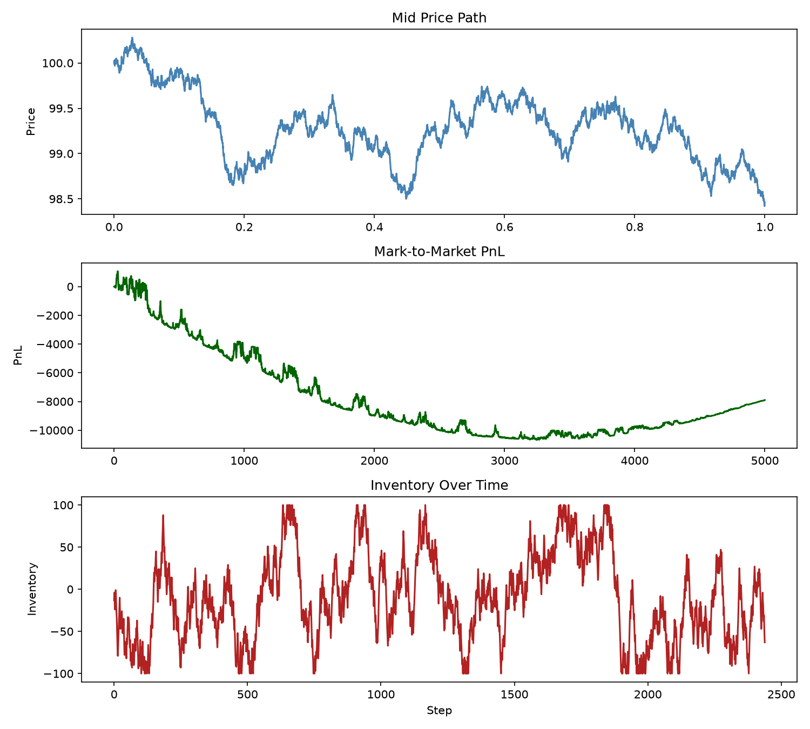
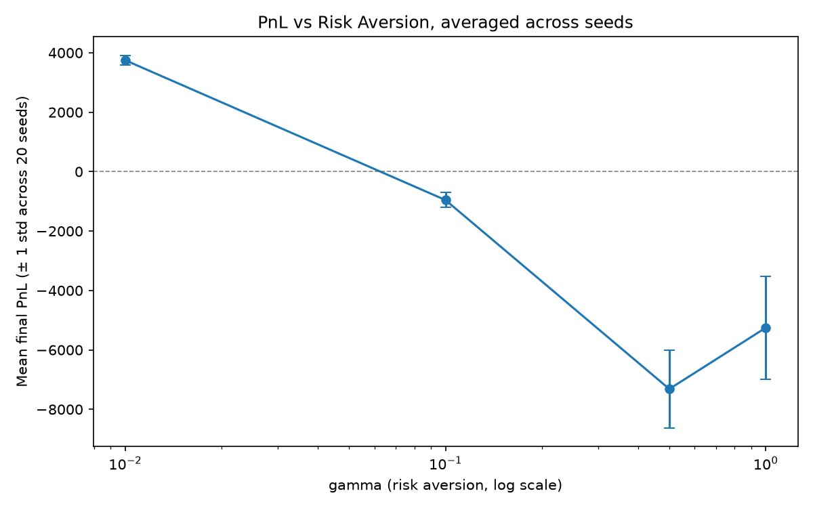

# Market Making Engine

A market-making and execution simulation engine, built around the Avellaneda-Stoikov
optimal quoting model. Simulates a full trading loop: synthetic order flow, a
price-time-priority limit order book, an inventory-aware quoting agent, and a
backtester that ties them together and measures PnL/inventory risk.

## Components

- **`src/order_book.py`** — Limit order book with price-time priority matching,
  partial fills, and order cancellation.
- **`src/order_flow.py`** — Synthetic order flow generator (Poisson arrivals,
  random price/size distributions around a drifting mid price).
- **`src/market_maker.py`** — Avellaneda-Stoikov market-making agent. Computes a
  reservation price and optimal spread from inventory, volatility, and time
  horizon; tracks PnL and inventory.
- **`src/backtester.py`** — Wires the above together. Each step: mid price drifts,
  the agent quotes, a random aggressor order may fill one side of the quote with
  probability that decays as the quoted spread widens (capped so inventory never
  exceeds the agent's limit), and PnL/inventory are recorded.

## Running it

\`\`\`bash
source venv/bin/activate
pip install -r requirements.txt
pytest tests/ -v                              # 24 tests, all passing
python notebooks/run_backtest.py               # single backtest run + PnL/inventory plot
python notebooks/gamma_sweep_multiseed.py      # gamma sensitivity, averaged over 20 seeds
\`\`\`

## Key result: risk aversion (gamma) sensitivity

Running the backtest across risk-aversion values (`gamma = 0.01, 0.1, 0.5, 1.0`),
averaged over 20 random seeds per value, shows two effects:

1. **Fill rate correctly falls as gamma rises** (664 → 581 → 346 → 226 average fills).
   Higher risk aversion widens the agent's quoted spread, and — since fill
   probability is modeled to decay with spread width — the agent is rightly hit
   less often. This matches the theoretical intuition that a rational market
   taker avoids crossing an unfavorable spread.

2. **Mean PnL does not recover as gamma increases past 0.01** (+3,749 at gamma=0.01,
   then -956, -7,316, -5,255 at gamma=0.1/0.5/1.0). Standard Avellaneda-Stoikov
   intuition suggests higher risk aversion should protect PnL by tightening
   inventory control. Here it doesn't, because in this simulated environment the
   mid-price's own random walk (independent Gaussian drift each step) does more
   damage to PnL than inventory risk does — fewer, wider-spread fills reduce
   adverse selection risk but also reduce the fraction of favorable spread the
   agent captures, and the net effect is dominated by mid-price noise rather than
   inventory risk.

This is a genuine limitation of the simulation's price process (a driftless random
walk with no fundamental value or mean reversion), not a bug in the AS
implementation — the reservation price and spread formulas were independently
tested and match theory (spread widens correctly with gamma; reservation price
shifts correctly with inventory sign and magnitude). A natural extension would be
to give the mid price a mean-reverting or trend-following structure, which should
let inventory-aversion benefits show through more clearly in the PnL.

## Testing

All four components have independent unit tests (`tests/`), covering matching
logic, distributional properties of synthetic flow, reservation price and spread
formulas, inventory limit enforcement, and reproducibility under fixed seeds.